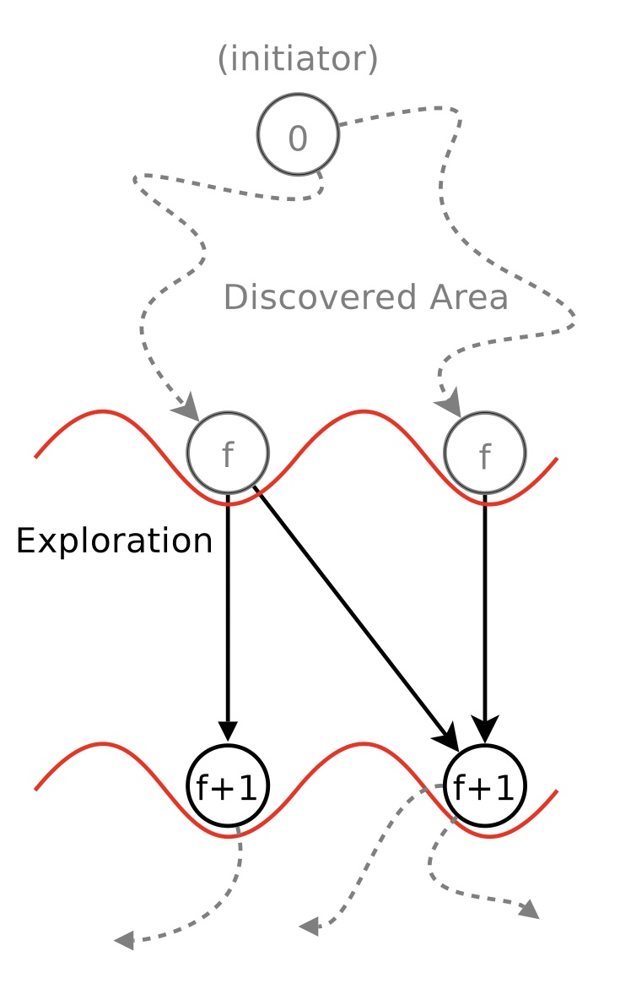
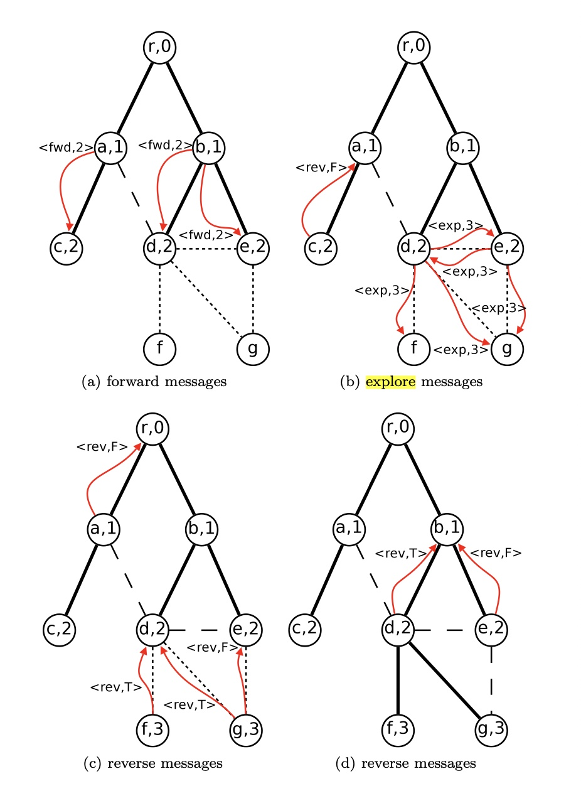
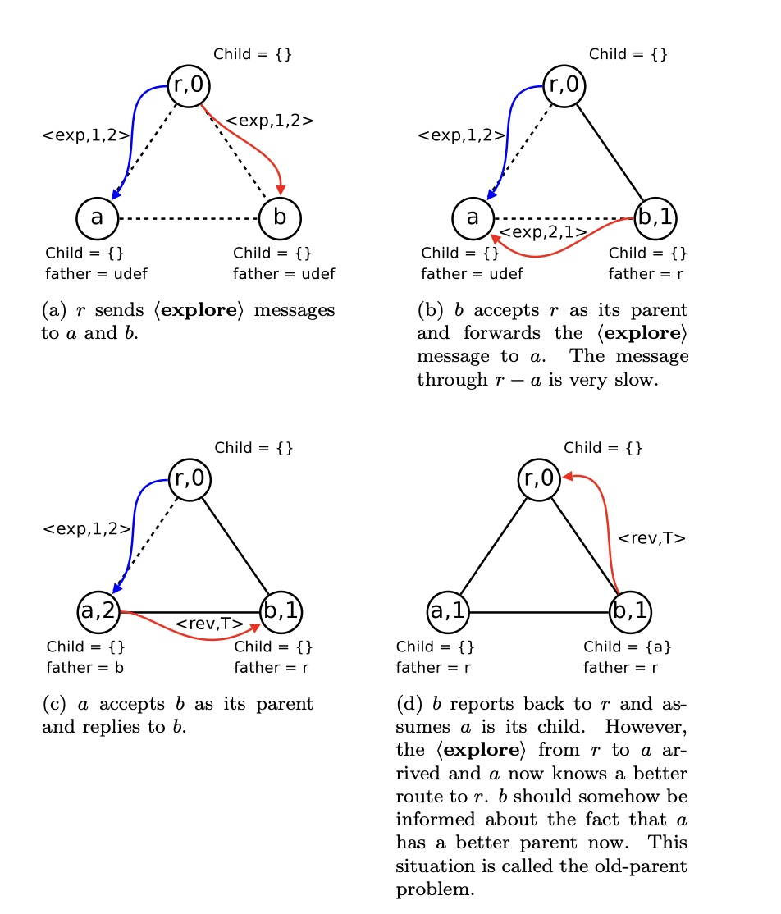
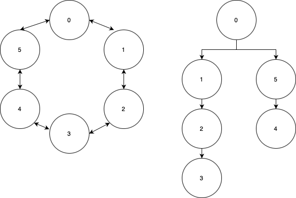

.. include:: substitutions.rst

Implementation, Results and Discussion
======================================

Implementation and Methodology
~~~~~~~~~~~~~~~~~~~~~~~~~~~~~~~~~~~~

The implementation of the Simple Frederickson's algorithm was carried out in the AHCv2 Python environment. Testing was conducted on various topologies, including ring and mesh topologies, to assess the algorithm's effectiveness. The primary objective of the algorithm is to function across all kinds of topologies. Frederickson's distributed BFS algorithm is well-suited for this purpose, as it efficiently finds the minimum path to any node, a critical feature in graph networks. Before delving into the implementation details, consider a ring topology where each node has two communication interfaces: one with the preceding node and another with the following node. This algorithm enables faster communication between nodes compared to the basic method of "passing the message to the right/left peer" because each node understands the path to a different node and how to transmit the information. Detailed and graphical results will be presented in the Results section. The research was conducted by reviewing papers on this algorithm, and the pseudocodes are provided in Section 1.3, "Distributed Algorithm." We employed the same coding scheme to implement the distributed algorithm in the AHCv2 environment.

  
  The Frederickson's Algorithm Methodology

1. Explore Messages:
When an ⟨explore,f⟩ message arrives at some node u for the first time (i.e. when levelu = inf), node u is discovered by v and will be added to the subtree of v. Node v becomes the parent of u and the level of u (the depth of u in the BFS tree) is bound to f. To let v know that u has become its child, u sends back a reply ⟨reverse, true⟩

2. Forward Messages:
⟨forward,f⟩ messages are used to let the front nodes know they must send ⟨explore, f + 1⟩ messages to their unknown neighbors. If a node u at levelu < f receives such a ⟨forward, f ⟩ message, it forwards it to each child

3. Reverse Messages:
If a ⟨reverse, true⟩ message arrives at u it is certain that v is a child of u since the two cases in which such a message can arrive are:
first,v is just discovered by u, and thus becomes its child
second,v just discovered a new node in its subtree, and reports this back to its
parent u, so v is already a child of u.
In any case, we add v to the set of children of u (again) and we set bvalueu to true, to store that a ⟨reverse, true⟩ arrived.

  
  Example Run for (forward,2) Message

There are two issues in the implementation that could be addressed in future work. The first issue is the "old parent" problem, and the second is the omission of peer messaging in the implementation. Starting with the issue of missing peer messaging, when we investigate further "example run", it is evident that there is no response to a peer's explore message because the peer nodes are on the same level. According to the implementation described in the paper, communicating with peers is deemed unnecessary. The advanced Frederickson's algorithm addresses this issue by defining a new message type that allows nodes to also keep track of their connected peers. In the current implementation, all components are "logically" considered connected either up or down. The algorithm determines whether a connection is considered up or down based on which message is received first by a node. Addressing peer connections could be a focus for future work. It's important to note that in the topologies, nodes are not connected as peers; there is always a connector acting as a messaging bus.

Regarding the "old parent" problem, an error condition is visible in the provided figure 3 "The Old Parent Problem" . However, this issue will not occur in the AHCv2 environment because the propagation delay of all channels and connectors is the same, allowing messages to be heard simultaneously in simulations. Although this is not a problem in the simulated environment, it could be an issue in real-world applications where the algorithm might not perform correctly. To resolve this, new message types could be introduced as suggested in the paper, adding parent node information to explore messages to rectify the issue. While this solution is not yet implemented, it presents a potential area for future development.

  
  The Old Parent Problem

Results
~~~~~~~~

In AHCv2 environment we have provided 2 different topologies first one is ring, the second one is a random graph. The connections are showed in the given figure 4 and 5. The implementation's messages for 2 topologies are added to index reader may check that also.

1. Ring topology result:

When we look at the figure Ring Topology and Resulting BFS Tree, we can see the BFS tree and the initiator node is zero. We can see the levels of the tree. Note that the node 3, can either in the branch from 1 and 2 id nodes as in the figure but it can either be in the branch collected from 0 - 5 - 4. The algorithm determines this. The faster node, which sends the explore message, wins the children. But it can change simulation run to run.
The resulting message from implementation is like this and annunced to the network:
 1. BFS Completed Reverse ....
 2. Tree :  {1: {2: {3: {}}}, 5: {4: {}}}
 3. Exiting 

  
  Ring Topology and Resulting BFS Tree

2. Random graph topology result:
 When we look at the figure Random Topology and Resulting BFS Tree, we can see the BFS tree and the initiator node is zero also. But in this case the BFS tree is fixed, and the algorithm will always give this result if every node in the network is alive. Algorithm is not checking the nodes aliveness:

 1. BFS Completed Reverse ....
 2.  Tree :  {1: {2: {}, 4: {5: {}}}, 3: {}}
 3.  Exiting

.. figure:: figures/grap_random.png
  :width: 250
  
  Random Topology and Resulting BFS Tree

We can extend the results obtained from the random graph to the mesh topology. As clearly observed from the results, the algorithm performs as anticipated. From the perspective of the zeroth node, the BFS tree is generated and communicated across the network.

Upon examining the graphical representations, we see that a minimum spanning tree is also generated, allowing the zeroth node to efficiently send messages to any desired node. A critical aspect of distributed networks, known as messaging complexity, reflects the total number of messages required by the algorithm to converge to a result. We can determine that the messaging complexity is strictly limited to  O(V^2). This complexity is not influenced by changes in topology but rather by the number of nodes, provided they are not connected as peers, which would indicate an issue with the algorithm's implementation.

Discussion
~~~~~~~~~~

After implementing this algorithm, we gained several crucial insights about distributed networks, including BFS and MST on these networks.

Firstly, creating an MST is crucial for efficiently delivering messages to nodes. Secondly, it's important to acknowledge that distributed networks may not always exhibit predictable behavior. The implemented code must accommodate all edge cases. In this context, propagation delay poses a significant challenge. We did not devise a solution for this within the AHCv2 environment, as it does not present this issue due to uniform message passing times across channels. However, the old-parent problem remains a significant concern in real-life applications. We have outlined potential future work on this topic in the Implementation and Methodology section.

In conclusion, we can identify two potential future developments for Frederickson's algorithm implementation:

1. Introducing new message types to address the old parent problem.
2. Implementing a mechanism to handle peer connections.
 
