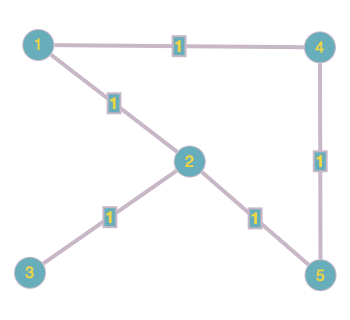
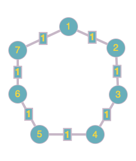

.. include:: substitutions.rst

Implementation, Results and Discussion
======================================

Implementation and Methodology
~~~~~~~~~~~~~~~~~~~~~~~~~~~~~~~~~~~~

In the algorithm section we have discussed the two varients of the Toueg's distributed shortest path algorithm. We have implemented the full variant one by using AHCv2 environemnt. In this section we will be focusing on how the implemented algorithm works and the messaging between the nodes when the shortest path forms.

The TOUEG method implements a distributed routing algorithm designed to compute shortest paths within a network. The method is part of a class that requires the following instance variables: process_id, Su, ParentInformation, and DistanceInformation.

Parameters:

vertices (list): A list of all vertex IDs within the network. Each vertex ID uniquely identifies a node in the network.
neighbors (list): A list of neighboring vertex IDs for the current node, indicating direct connections within the network.
neighbor_weights (dict): A mapping from each neighbor vertex ID to the weight of the edge connecting it with the current node. These weights are used to calculate the shortest paths.

Algorithm Overview:

Initialization:
The current node initializes its distance and parent information. The distance to itself is set to 0, to direct neighbors as the weight of the respective edges, and to all other vertices as infinity. The parent of each vertex is initially set to the vertex itself for neighbors and to None for others.

Pivot Selection and Propagation:
The vertices are sorted, and the algorithm iteratively selects each vertex as a pivot. For each pivot, the algorithm sends a message to each neighbor. If the neighbor is the pivot's parent, it receives a "Child" message; otherwise, a "NotChild" message is sent.

Synchronization and Distance Updating:
The node waits until all neighbors have acknowledged the pivot. If the distance to the pivot is not infinity, and the current node is not the pivot, it requests updated distance information from the pivot's parent. The distances are then potentially updated if a shorter path is found. This involves recursive updates as the algorithm progresses through all vertices.

Conclusion:
The algorithm continues until all vertices are processed. The set Su keeps track of processed vertices. Once all vertices are included in Su, the algorithm outputs the shortest path information, including distances and parent-child relationships across the network.
Output:

The method returns a tuple containing two dictionaries: DistanceInformation and ParentInformation, representing the shortest path distances and the parent-child relationships, respectively.
Dependencies:

The TOUEG method relies on several helper methods for message passing and synchronization, including sendMessageToNeighbor, getPendingChildMessageCount, waitPivotDistanceFrom, and getParticularChildMessage. These are critical for the distributed nature of the algorithm, allowing it to function across different nodes in a networked environment.

There are three types of messages Toueg's full-variant algorithm:

1. Messages ("INFO", "Child") are sent from u to x at the beginning of w -pivot round, if x is the parent of u in the tree Tw .
2. Messages ("INFO", "NotChild") are sent from u to x the beginning of w -pivot round, if x is not the parent of u in thetree Tw .
3. Messages ("DISTANCE", (pivot, D_pivot)) are sent during w -pivot round via every channel in the tree Tw to deliver the table Dw to each node that must use this value.

Results
~~~~~~~~

We are set to investigate the behavior of Toueg's algorithm using two different graphs and topologies. Initially, we will use a random graph. In all cases, the vertices are either unweighted or assigned a simple weight of 1. Although the algorithm is implemented with vertex weights set to 1, it can be modified to collect and process information on varying vertex weights as a future work.

The logical representation of the first topology, Graph 1, is depicted in Figure 1. Table 1 presents the matrix representation of the algorithm's results, which were derived using the Floyd-Warshall algorithm. As evident from the results, the implemented distributed Floyd-Warshall algorithm performs as expected.

We can adapt our results to any given graph and topology. The distributed algorithm, namely Toueg's algorithm, will converge to the results of the Floyd-Warshall algorithm for all configurations. We can conclude that the algorithm is consistent, provided there are no networking issues in the distributed environment.

  
  Topology Graph 1 

.. list-table:: Distance Matrix of Graph 1 Each Node to Each Node
   :widths: 20 20 20 20 20
   :header-rows: 1

   * - Node 1
     - Node 2
     - Node 3
     - Node 4
     - Node 5
   * - 0
     - 1
     - 2
     - 1
     - 2
   * - 1
     - 0
     - 1
     - 2
     - 1
   * - 2
     - 1
     - 0
     - 3
     - 2
   * - 1
     - 2
     - 3
     - 0
     - 1
   * - 2
     - 1
     - 2
     - 1
     - 0

The indexing of each node has been adjusted to start from 0. Therefore, while the original graph’s node indices begin at 1, they start from 0 in the algorithm's results. The corresponding results are presented below:

1. Path Finding has been completed 0 - {0: {0: 0, 1: 1, 2: 2, 3: 1, 4: 2}} 
2. Path Finding has been completed 1 - {1: {0: 1, 1: 0, 2: 1, 3: 2, 4: 1}} 
3. Path Finding has been completed 2 - {2: {0: 2, 1: 1, 2: 0, 3: 3, 4: 2}}
4. Path Finding has been completed 3 - {3: {0: 1, 1: 2, 2: 3, 3: 0, 4: 1}}
5. Path Finding has been completed 4 - {4: {0: 2, 1: 1, 2: 2, 3: 1, 4: 0}}

We will now investigate the behavior of the second topology, Graph 2, whose logical representation is depicted in Figure 2. The second toplogy can be defined as Ring toplogy which is widly used as network toplogy in real-life applications. Table 2 presents the matrix representation of the algorithm's results, obtained using the Floyd-Warshall algorithm. The results are detailed below the table. From the collected data, it is evident that the implemented distributed Floyd-Warshall algorithm performs as anticipated.

All connections are bidirectional and are thus represented as undirected graphs.

  
  Topology Graph 2

.. list-table:: Distance Matrix of Graph 2 Each Node to Each Node
   :widths: 20 20 20 20 20 20 20
   :header-rows: 1

   * - Node 1
     - Node 2
     - Node 3
     - Node 4
     - Node 5
     - Node 6
     - Node 7
   * - 0
     - 1
     - 2
     - 3
     - 3
     - 2
     - 1
   * - 1
     - 0
     - 1
     - 2
     - 3
     - 3
     - 2
   * - 2
     - 1
     - 0
     - 1
     - 2
     - 3
     - 3
   * - 3
     - 2
     - 1
     - 0
     - 1
     - 2
     - 3
   * - 3
     - 3
     - 2
     - 1
     - 0
     - 1
     - 2
   * - 2
     - 3
     - 3
     - 2
     - 1
     - 0
     - 1
   * - 1
     - 2
     - 3
     - 3
     - 2
     - 1
     - 0

The indexing of each node has been adjusted to start from 0. Therefore, while the original graph’s node indices begin at 1, they start from 0 in the algorithm's results. The corresponding results are presented below:

1. Path Finding has been completed 0 - {0: {0: 0, 1: 1, 2: 2, 3: 3, 4: 3, 5: 2, 6: 1}}
2. Path Finding has been completed 1 - {1: {0: 1, 1: 0, 2: 1, 3: 2, 4: 3, 5: 3, 6: 2}}
3. Path Finding has been completed 2 - {2: {0: 2, 1: 1, 2: 0, 3: 1, 4: 2, 5: 3, 6: 3}}
4. Path Finding has been completed 3 - {3: {0: 3, 1: 2, 2: 1, 3: 0, 4: 1, 5: 2, 6: 3}}
5. Path Finding has been completed 4 - {4: {0: 3, 1: 3, 2: 2, 3: 1, 4: 0, 5: 1, 6: 2}}
6. Path Finding has been completed 5 - {5: {0: 2, 1: 3, 2: 3, 3: 2, 4: 1, 5: 0, 6: 1}}
7. Path Finding has been completed 6 - {6: {0: 1, 1: 2, 2: 3, 3: 3, 4: 2, 5: 1, 6: 0}}

Discussion
~~~~~~~~~~

In our research, we employed a qualitative data representation format for detailed analysis. The issue at hand is mathematical in nature, allowing for the use of graphs, algorithms, and various representations to illustrate the results.

In conclusion, Toueg's distributed algorithm can be effectively used to solve all-pairs shortest path problems within a distributed network environment. This is a crucial learning point of this paper because routing is one of the most significant challenges in networking. Data travel efficiency is a key element for fast and reliable communication. When data is transferred from one point to another with minimal travel time, it impacts overall energy consumption, bandwidth usage, and computational power at each network node.

There are some limitations to this algorithm. Since it runs for all nodes, a large network with numerous nodes will significantly increase the overall time required for the algorithm to converge. Therefore, exploring intelligent logical approaches to address this issue would be a valuable direction for future research.
